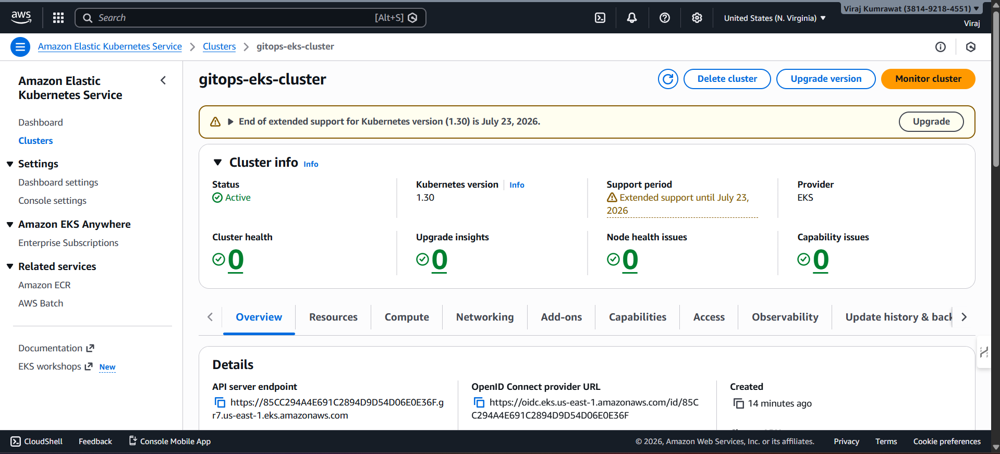
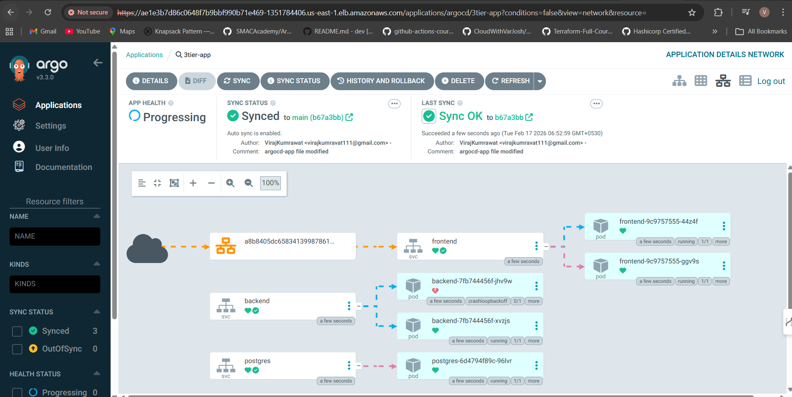
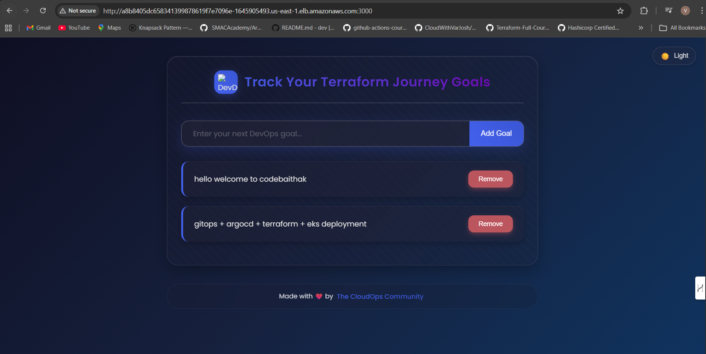

# 🚀 GitOps with ArgoCD on Amazon EKS using Kustomize

## 📌 Project Overview

Amazon EKS + ArgoCD + Kustomize + Terraform + 3-Tier Application

This project demonstrates a **complete GitOps workflow** where a 3-tier web application is deployed on **Amazon EKS** using **ArgoCD** and **Kustomize**.

Infrastructure is provisioned using **Terraform**, and application deployments are fully managed using the **GitOps model**.

ArgoCD continuously monitors the Git repository and ensures the Kubernetes cluster state always matches the desired state defined in Git.

---

# 🏗️ Architecture Overview

GitHub (K8s Manifests)  
⬇  
ArgoCD (Continuous Reconciliation)  
⬇  
Amazon EKS Cluster  
⬇  
3-Tier Application (React + Node.js + PostgreSQL)

---

# 🧩 3-Tier Application Architecture

### 🖥️ Frontend
- React Application
- Runs on Port **3000**
- Exposed via AWS Load Balancer

### ⚙️ Backend
- Node.js API
- Runs on Port **8080**
- Connects to PostgreSQL

### 🗄️ Database
- PostgreSQL
- Runs on Port **5432**
- Persistent storage inside cluster

---

# ☁️ Infrastructure Setup

## 🌐 Custom VPC Setup (Terraform)

- Custom VPC (10.0.0.0/16)
- Public & Private Subnets (Multi-AZ)
- Internet Gateway
- NAT Gateway
- Route Tables
- Security Groups

### 📸 VPC Output

---

## ☸️ Amazon EKS Cluster

- Multi-AZ EKS Cluster
- Managed Node Group
- IAM Roles & Policies
- OIDC Enabled

### 📸 EKS Cluster Output

---

# 🔄 GitOps Implementation with ArgoCD

- ArgoCD installed inside EKS
- Application defined using `Application` CRD
- Auto-Sync Enabled
- Self-Heal Enabled
- Drift Detection Active

### 📸 ArgoCD Application View

---

# 🚀 Deployment Workflow

1. Infrastructure provisioned using Terraform.
2. EKS cluster created with worker nodes.
3. ArgoCD installed in cluster.
4. Kubernetes manifests pushed to GitHub.
5. ArgoCD automatically syncs application.
6. Application deployed inside EKS.
7. AWS Load Balancer exposes frontend.

---

# 🌍 Final Application Output

The React frontend successfully communicates with the backend API and PostgreSQL database.

### 📸 Final Deployed Application UI

---

# 🔐 Key Features Implemented

✅ GitOps Deployment Model  
✅ Infrastructure as Code (Terraform)  
✅ Kustomize for Environment Management  
✅ ArgoCD Auto-Sync & Self-Healing  
✅ 3-Tier Microservices Architecture  
✅ AWS Load Balancer Integration  
✅ Multi-AZ High Availability  

---

# 📊 Outcome

- Successfully deployed production-style GitOps architecture on AWS.
- Implemented declarative infrastructure and deployment strategy.
- Achieved automatic reconciliation and drift correction.
- Reduced manual Kubernetes deployment effort to zero.

---

# 🛠️ Tools & Technologies

- Terraform
- Amazon VPC
- Amazon EKS
- Kubernetes
- ArgoCD
- Kustomize
- AWS ALB

---

# 🙏 Special Thanks

Special thanks to **[Piyush Sachdeva](https://github.com/piyushsachdeva)**  
for guidance, learning resources, and continuous inspiration in the DevOps & Cloud journey.